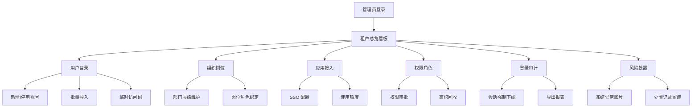

## 1. 产品概述

统一认证中心 Web 管理应用是面向集团信息管理员的集中式身份与访问管理平台，用于统一维护全集团账号体系、登录策略、权限分配与安全审计。解决多系统账号分散、权限失控、安全审计缺失等问题。

- 目标用户：集团 IT 信息管理员、安全审计人员、组织人事管理员
- 核心价值：集中管控身份全生命周期，强化访问安全，降低合规风险

## 2. 核心特性

### 2.1 用户角色

| 角色 | 注册方式 | 核心权限 |
|------|----------|----------|
| 超级管理员 | 系统预置 | 全部功能：租户配置、全局策略、审计处置、权限审批 |
| 组织管理员 | 超级管理员指派 | 本部门用户维护、岗位绑定、权限申请初审 |
| 安全审计员 | 超级管理员指派 | 登录审计查看、风险处置、报表导出、操作留痕 |
| 应用管理员 | 超级管理员指派 | 本应用接入配置、SSO 设置、使用热度查看 |

### 2.2 功能模块

1. **租户总览**：全局数据看板、活跃用户趋势、应用使用热度、风险预警、快捷入口
2. **用户目录**：账号 CRUD、启用/停用、批量导入、岗位绑定、密码重置、临时访问码
3. **组织岗位**：部门层级树维护、岗位管理、岗位-角色绑定、成员归属
4. **应用接入**：应用注册、SSO 配置（OIDC/SAML/CAS）、回调地址、密钥管理、启用停用
5. **权限角色**：角色体系、菜单/数据权限矩阵、权限申请审批、离职权限回收
6. **登录审计**：登录日志、地点设备、失败原因、会话强制下线、审计报表导出
7. **风险处置**：异常账号冻结、风险规则配置、风险事件追踪、处置记录

### 2.3 页面详情

| 页面名称 | 模块名称 | 功能描述 |
|----------|----------|----------|
| 租户总览 | 核心指标卡片 | 展示总用户数、活跃用户、在线会话、接入应用、待审批数、风险告警 |
| 租户总览 | 趋势图表 | 最近 30 天活跃用户折线图、登录成功率、应用使用热度排行 |
| 租户总览 | 风险预警列表 | 高危登录、异常设备、异地登录实时预警 |
| 租户总览 | 快捷操作区 | 新增用户、批量导入、创建应用、审批入口快捷按钮 |
| 用户目录 | 用户列表 | 搜索/筛选、分页、行内操作（启用/停用、重置密码、详情） |
| 用户目录 | 新增用户 | 表单录入、部门选择、岗位分配、角色绑定 |
| 用户目录 | 批量导入 | 模板下载、Excel 上传、预览校验、冲突处理 |
| 用户目录 | 用户详情 | 基础信息、登录历史、权限清单、会话管理、操作日志 |
| 用户目录 | 临时访问码 | 生成一次性访问码、有效期设置、用途备注、发送方式 |
| 组织岗位 | 组织树 | 部门层级树、拖拽排序、新增/编辑/删除部门、部门人数统计 |
| 组织岗位 | 岗位管理 | 岗位列表、岗位-角色绑定、岗位成员、编制设置 |
| 组织岗位 | 成员归属 | 批量调整部门、兼职岗位、主岗设置 |
| 应用接入 | 应用列表 | 应用卡片/列表视图、搜索分类、启用/停用切换 |
| 应用接入 | 应用配置 | 基础信息、协议选择（OIDC/SAML/CAS）、回调地址、Logo 上传 |
| 应用接入 | 密钥管理 | ClientID/Secret 生成、证书上传、签名算法、有效期管理 |
| 应用接入 | 访问策略 | IP 白名单、访问时段、MFA 强制要求 |
| 应用接入 | 使用热度 | 按日/周/月访问量、用户数排行、失败率统计 |
| 权限角色 | 角色列表 | 系统角色/自定义角色、角色成员数、权限数量 |
| 权限角色 | 权限矩阵 | 菜单权限、按钮权限、数据范围交叉配置 |
| 权限角色 | 权限申请审批 | 待审批列表、审批详情、通过/驳回、审批意见 |
| 权限角色 | 离职权限回收 | 离职人员清单、权限回收确认、审计记录 |
| 登录审计 | 登录日志列表 | 时间、用户、应用、IP、地点、设备、状态筛选 |
| 登录审计 | 登录详情 | 设备指纹、浏览器、操作系统、登录链路、失败原因 |
| 登录审计 | 会话管理 | 在线会话列表、强制下线、会话详情 |
| 登录审计 | 报表导出 | 按条件筛选、Excel/PDF 导出、导出任务留痕 |
| 风险处置 | 风险概览 | 风险等级分布、待处置事件、处置效率统计 |
| 风险处置 | 异常账号 | 异常检测列表、账号冻结/解冻、处置备注 |
| 风险处置 | 风险规则 | 规则配置（异地登录、暴力破解、异常时段等）、阈值设置 |
| 风险处置 | 处置记录 | 全量操作审计、处置人、时间、结果可追溯 |
| 全局 | 管理员操作留痕 | 所有管理操作记录：操作人、时间、对象、前后值、IP |

## 3. 核心流程

### 3.1 新员工入职全流程
管理员在用户目录新增员工 → 选择归属部门与岗位 → 自动关联岗位角色权限 → 发送初始密码/临时访问码 → 员工首次登录强制修改密码 → 登录审计记录全流程。

### 3.2 应用接入 SSO 配置流程
新增应用 → 填写基本信息 → 选择 SSO 协议（OIDC/SAML）→ 配置回调地址 → 生成 ClientID/Secret → 下载元数据/配置文件 → 启用应用 → 验证单点登录联调。

### 3.3 权限申请审批流程
用户提交权限申请 → 上级组织管理员初审 → 超级管理员终审 → 通过后自动授权 → 发送通知 → 操作全量留痕。

### 3.4 风险事件处置流程
风控规则触发 → 生成风险事件 → 安全审计员审核 → 冻结账号/强制下线/放行 → 记录处置结果 → 生成审计记录。

## 4. 用户界面设计

### 4.1 设计风格

- **主色调**：深靛蓝 `#1E3A8A` 作为主色，体现企业级专业感与可信安全；辅助色为宝石青 `#0D9488`（安全/成功）与琥珀橙 `#F59E0B`（风险/警告）
- **按钮风格**：直角微圆角（4px），主按钮实心填充，次按钮描边空心，悬停微动效（0.2s 过渡 + 轻微上浮阴影）
- **字体**：标题使用 `Noto Serif SC`（庄重正式），正文使用 `JetBrains Mono` + `PingFang SC`（数据清晰可读）
- **布局风格**：左侧固定深色侧边栏 + 顶部导航面包屑 + 主内容卡片化分区，典型企业后台布局
- **图标风格**：线性描边图标（Lucide React），统一 1.5px 线宽，状态色语义化

### 4.2 页面设计概览

| 页面名称 | 模块名称 | UI 元素 |
|----------|----------|----------|
| 租户总览 | 指标卡片 | 渐变背景卡片、数字动画计数器、趋势箭头微标、网格布局 3×2 |
| 租户总览 | 图表区 | Recharts 双折线组合图、水平条形热度排行、环形风险分布 |
| 租户总览 | 预警列表 | 表格 + 风险等级徽章（红/橙/黄）、行内快速处置按钮 |
| 用户目录 | 工具栏 | 搜索框（左侧）+ 筛选标签 + 右侧操作按钮组（新增/导入/导出） |
| 用户目录 | 数据表格 | 固定表头、斑马行、头像+姓名组合列、状态开关、行内操作下拉 |
| 用户目录 | 抽屉表单 | 右侧滑出抽屉、分步表单、表单校验实时提示 |
| 组织岗位 | 左右分栏 | 左侧组织树（可拖拽）+ 右侧详情 Tab（岗位/成员/权限） |
| 应用接入 | 卡片网格 | 应用 Logo 卡片网格、悬停浮起效果、状态徽章、快捷操作菜单 |
| 登录审计 | 时间线视图 | 可选切换表格/时间线、地图标记登录地点、设备图标标识 |
| 风险处置 | 态势面板 | 风险等级大盘数字 + 环形图、事件列表时间线、处置状态流转 |

### 4.3 响应式设计

- **设计原则**：桌面优先（1440px 基准），兼容平板（1024px）折叠显示
- **侧边栏**：< 1280px 自动收起为图标模式，点击展开抽屉
- **数据表格**：< 1024px 切换为卡片列表视图，隐藏次要列
- **图表区**：响应式容器，移动端单列堆叠
- **触摸优化**：最小点击热区 44×44px，表单控件移动端放大

### 4.4 视觉差异化设计

- **背景氛围**：主内容区采用浅灰底 `#F8FAFC` + 微噪点纹理叠加，避免纯白单调
- **卡片质感**：卡片采用「上层白卡 + 下层投影 + 1px 极细描边」三层结构，投影方向偏右下 2px 偏移
- **品牌图形**：顶部导航左侧放置品牌 Logo（盾形 + 钥匙抽象几何图形），主色渐变填充
- **微动效**：
  - 页面进入：子卡片 `staggered fade-in-up`（延迟 50ms 递增）
  - 数据加载：骨架屏脉冲动画
  - 表格行：悬停背景色线性过渡 + 左侧 3px 主色竖条显现
  - 抽屉/模态：`transform` 滑入 + `backdrop-blur` 背景虚化
- **状态语义**：
  - 成功/安全：宝石青 + ✓ 图标
  - 警告/待处理：琥珀橙 + ⚠ 图标
  - 危险/冻结：朱砂红 `#DC2626` + ✕ 图标
  - 信息/中性：深靛蓝 + ℹ 图标
