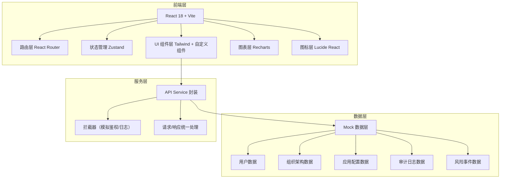
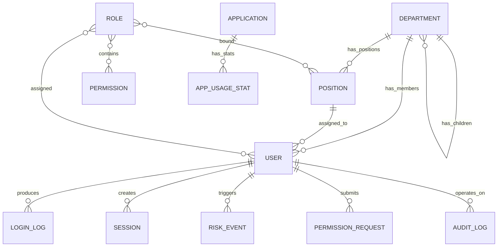

## 1. 架构设计



## 2. 技术说明

- **前端框架**：React@18 + TypeScript + Vite@5
- **初始化工具**：Vite 官方模板（react-ts）
- **样式方案**：Tailwind CSS@3 + PostCSS + Autoprefixer
- **路由管理**：React Router DOM@6
- **状态管理**：Zustand（轻量状态管理，替代 Redux）
- **UI 组件库**：Headless UI（无样式组件）+ 自定义业务组件
- **图表可视化**：Recharts@2
- **图标库**：Lucide React
- **后端**：无（纯前端 Mock 数据实现）
- **数据库**：无（本地 Mock JSON 数据 + localStorage 持久化）
- **表单处理**：React Hook Form + Zod 校验
- **日期处理**：date-fns

## 3. 路由定义

| 路由路径 | 页面名称 | 功能说明 |
|----------|----------|----------|
| `/` | 重定向 `/dashboard` | 默认跳转租户总览 |
| `/dashboard` | 租户总览 | 数据看板、趋势图、风险预警 |
| `/users` | 用户目录 | 用户列表、新增/停用、批量导入、详情 |
| `/organization` | 组织岗位 | 部门树、岗位管理、成员归属 |
| `/applications` | 应用接入 | 应用列表、SSO 配置、使用热度 |
| `/permissions` | 权限角色 | 角色管理、权限矩阵、审批、回收 |
| `/audit` | 登录审计 | 登录日志、会话管理、报表导出 |
| `/risk` | 风险处置 | 风险概览、异常账号、处置记录 |

## 4. API 定义（Mock 接口层 TypeScript 类型）

```typescript
// ===== 用户相关 =====
interface User {
  id: string;
  username: string;
  name: string;
  email: string;
  phone: string;
  avatar?: string;
  departmentId: string;
  positionId: string;
  roleIds: string[];
  status: 'active' | 'disabled' | 'frozen';
  mfaEnabled: boolean;
  lastLoginAt?: string;
  lastLoginIp?: string;
  createdAt: string;
  createdBy: string;
}

interface CreateUserDTO {
  username: string;
  name: string;
  email: string;
  phone: string;
  departmentId: string;
  positionId: string;
  roleIds: string[];
}

// ===== 组织架构 =====
interface Department {
  id: string;
  name: string;
  parentId: string | null;
  code: string;
  leaderId?: string;
  sort: number;
  memberCount: number;
  children?: Department[];
}

interface Position {
  id: string;
  name: string;
  code: string;
  departmentId: string;
  roleIds: string[];
  memberCount: number;
  quota?: number;
}

// ===== 应用接入 =====
interface Application {
  id: string;
  name: string;
  code: string;
  logo?: string;
  description?: string;
  protocol: 'OIDC' | 'SAML' | 'CAS' | 'OAuth2';
  clientId?: string;
  clientSecret?: string;
  callbackUrls: string[];
  logoutUrls: string[];
  ipWhitelist: string[];
  mfaRequired: boolean;
  accessHours?: { start: string; end: string };
  status: 'enabled' | 'disabled';
  sort: number;
  createdAt: string;
}

interface AppUsageStat {
  appId: string;
  date: string;
  loginCount: number;
  uniqueUsers: number;
  failCount: number;
}

// ===== 权限角色 =====
interface Role {
  id: string;
  name: string;
  code: string;
  type: 'system' | 'custom';
  description?: string;
  permissions: Permission[];
  memberCount: number;
  createdAt: string;
}

interface Permission {
  id: string;
  code: string;
  name: string;
  type: 'menu' | 'button' | 'data';
  parentId: string | null;
  sort: number;
}

interface PermissionRequest {
  id: string;
  userId: string;
  userName: string;
  roleId: string;
  roleName: string;
  reason: string;
  status: 'pending' | 'approved' | 'rejected';
  submitAt: string;
  approverId?: string;
  approveAt?: string;
  approveRemark?: string;
}

// ===== 登录审计 =====
interface LoginLog {
  id: string;
  userId: string;
  userName: string;
  appId: string;
  appName: string;
  ip: string;
  location: string;
  deviceType: 'desktop' | 'mobile' | 'tablet';
  os: string;
  browser: string;
  deviceFingerprint: string;
  status: 'success' | 'fail';
  failReason?: string;
  loginAt: string;
  sessionId?: string;
}

interface Session {
  id: string;
  userId: string;
  userName: string;
  appId: string;
  appName: string;
  ip: string;
  loginAt: string;
  lastActiveAt: string;
  userAgent: string;
  isOnline: boolean;
}

// ===== 风险处置 =====
interface RiskEvent {
  id: string;
  type: '异地登录' | '暴力破解' | '异常时段' | '异常设备' | '高频失败';
  level: 'high' | 'medium' | 'low';
  userId: string;
  userName: string;
  ip: string;
  description: string;
  detectedAt: string;
  status: 'pending' | 'resolved' | 'ignored';
  handlerId?: string;
  handleAt?: string;
  handleRemark?: string;
  handleAction?: 'freeze' | 'logout' | 'release';
}

interface RiskRule {
  id: string;
  name: string;
  type: string;
  enabled: boolean;
  threshold: Record<string, number>;
  level: 'high' | 'medium' | 'low';
}

// ===== 操作留痕 =====
interface AuditLog {
  id: string;
  operatorId: string;
  operatorName: string;
  module: string;
  action: string;
  targetId: string;
  targetName: string;
  beforeValue?: string;
  afterValue?: string;
  ip: string;
  operateAt: string;
}
```

## 5. 数据模型关系图



## 6. 目录结构规划

```
src/
├── assets/                # 静态资源（字体、Logo、样式）
├── components/            # 通用组件
│   ├── layout/           # 布局组件（Sidebar、Header、Breadcrumb）
│   ├── ui/               # 基础 UI（Card、Button、Table、Modal、Drawer）
│   └── charts/           # 图表组件封装
├── pages/                 # 页面组件
│   ├── Dashboard.tsx     # 租户总览
│   ├── Users.tsx         # 用户目录
│   ├── Organization.tsx  # 组织岗位
│   ├── Applications.tsx  # 应用接入
│   ├── Permissions.tsx   # 权限角色
│   ├── Audit.tsx         # 登录审计
│   └── Risk.tsx          # 风险处置
├── stores/                # Zustand 状态管理
│   ├── useUserStore.ts
│   ├── useOrgStore.ts
│   └── useAuthStore.ts
├── mock/                  # Mock 数据
│   ├── users.ts
│   ├── organization.ts
│   ├── applications.ts
│   ├── audit.ts
│   └── risk.ts
├── types/                 # TypeScript 类型定义
│   └── index.ts
├── utils/                 # 工具函数
│   ├── format.ts
│   └── constants.ts
├── router/                # 路由配置
│   └── index.tsx
├── App.tsx
├── main.tsx
└── index.css
```
